# Bug H.1

| Параметр | Значение |
|----------|----------|
| **Описание** | В фильтре "Направление" указано "Data Science", значит по логике не должно быть иных всплывающих фильтров-подсказок, таких как "Data Science", "Поддержка пользователей", "Аналитик" |
| **Проект** | QA-trainee-assignment-autumn-2025 (Задание 1) |
| **Приоритет (Priority)** | High |
| **Ожидаемый результат** | Только всплывающая фильтр-подсказка "Data Science", либо же никаких фильтров-подсказок |
| **Полученный результат** | Фильтры-подсказки "Data Science", "Поддержка пользователей", "Аналитик" |
| **Скриншот** | 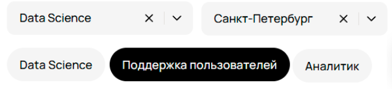 |
| **Пояснение приоритета** | Баг вводит пользователя в заблуждение, т.к он уже указал искомое направление |

# Bug H.2

| Параметр | Значение |
|----------|----------|
| **Описание** | В фильтре "Направление" указано "Data Science", значит должны отображаться только вакансии из направления "Data Science" |
| **Проект** | QA-trainee-assignment-autumn-2025 (Задание 1) |
| **Приоритет (Priority)** | High |
| **Ожидаемый результат** | Только вакансии из направления "Data Science" |
| **Полученный результат** | Вакансии из других, не связанных направлений |
| **Скриншот** | 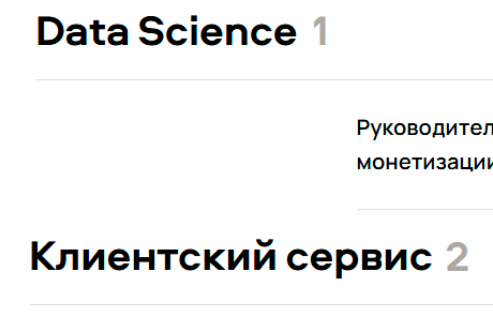 |
| **Пояснение приоритета** | Баг вводит пользователя в заблуждение, т.к он указал одно определенное направление для поиска |

# Bug H.3

| Параметр | Значение |
|----------|----------|
| **Описание** | В фильтре "Город" указано "Санкт-Петербург", значит по логике должны отображаться только вакансии, в которых точно должен присутствовать "Санкт-Петербург" |
| **Проект** | QA-trainee-assignment-autumn-2025 (Задание 1) |
| **Приоритет (Priority)** | High |
| **Ожидаемый результат** | Вакансии с городом "Санкт-Петербург" |
| **Полученный результат** | Вакансии в городах, среди которых нет "Санкт-Петербург" |
| **Скриншот** | 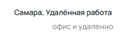 |
| **Пояснение приоритета** | Баг вводит пользователя в заблуждение, т.к ему были предложены вакансии, которые не соответствуют поиску по городу |

# Bug H.4

| Параметр | Значение |
|----------|----------|
| **Описание** | Среди фильтров-подсказок нажат фильтр "Поддержка пользователей", что говорит о том, что должны отображаться только вакансии из направления "Клиентский сервис" |
| **Проект** | QA-trainee-assignment-autumn-2025 (Задание 1) |
| **Приоритет (Priority)** | High |
| **Ожидаемый результат** | Только вакансии из направления "Клиентский сервис" |
| **Полученный результат** | Вакансии из других, не связанных направлений |
| **Скриншот** |  |
| **Пояснение приоритета** | Баг вводит пользователя в заблуждение, т.к он выбрал фильтр-подсказку, а ему были предложены вакансии, которые не соответствуют ей |

# Bug H.5

| Параметр | Значение |
|----------|----------|
| **Описание** | Был отмечен чекбокс "Руководящая роль", но отображаются вакансии, не подходящие под данный фильтр |
| **Проект** | QA-trainee-assignment-autumn-2025 (Задание 1) |
| **Приоритет (Priority)** | High |
| **Ожидаемый результат** | Только вакансии, связанные с руководящей должностью |
| **Полученный результат** | Вакансии, не связанные с руководящей должностью |
| **Скриншот** | 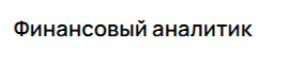 |
| **Пояснение приоритета** | Баг вводит пользователя в заблуждение, т.к он выбрал определенный чекбокс, а ему были предложены вакансии, которые не соответствуют ему |

# Bug H.6

| Параметр | Значение |
|----------|----------|
| **Описание** | В вакансии "Финансовый аналитик", где указан формат работы, написано "офис", хотя должно быть "офис и удаленно", если правильно сработал фильтр "Формат работы" с поиском "Можно удаленно" |
| **Проект** | QA-trainee-assignment-autumn-2025 (Задание 1) |
| **Приоритет (Priority)** | High |
| **Ожидаемый результат** | "офис и удаленно" |
| **Полученный результат** | "офис" |
| **Скриншот** | 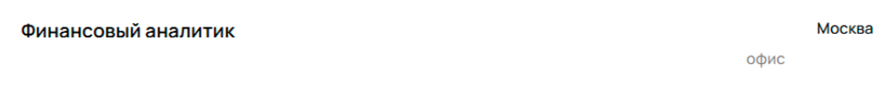 |
| **Пояснение приоритета** | Баг вводит пользователя в заблуждение, т.к он может пролистать эту вакансию из-за отсутствия возможности удаленной работы |

# Bug H.7

| Параметр | Значение |
|----------|----------|
| **Описание** | В вакансии "Аналитик данных в бизнес-команду Авито Авто" не указан город |
| **Проект** | QA-trainee-assignment-autumn-2025 (Задание 1) |
| **Приоритет (Priority)** | High |
| **Ожидаемый результат** | Город в вакансии |
| **Полученный результат** | Не указан город в вакансии |
| **Скриншот** |  |
| **Пояснение приоритета** |  Баг вводит пользователя в заблуждение, т.к он может пролистать эту вакансию из-за отсутствия указания города |

# Bug H.8

| Параметр | Значение |
|----------|----------|
| **Описание** | В вакансии "Аналитик данных в бизнес-команду Авито Авто", где указан формат работы, написано "офис", хотя должно быть "офис и удаленно", если правильно сработал фильтр "Формат работы" с поиском "Можно удаленно" |
| **Проект** | QA-trainee-assignment-autumn-2025 (Задание 1) |
| **Приоритет (Priority)** | High |
| **Ожидаемый результат** | "офис и удаленно" |
| **Полученный результат** | "офис" |
| **Скриншот** | 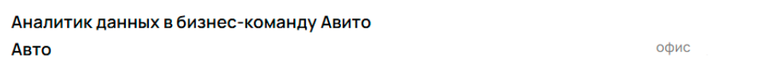 |
| **Пояснение приоритета** | Баг вводит пользователя в заблуждение, т.к он может пролистать эту вакансию из-за отсутствия возможности удаленной работы  |

# Bug M.1

| Параметр | Значение |
|----------|----------|
| **Описание** | Не прогружен значок крестика справа в поле ввода названия вакансии |
| **Проект** | QA-trainee-assignment-autumn-2025 (Задание 1) |
| **Приоритет (Priority)** | Medium |
| **Ожидаемый результат** | Прогруженный значок крестика |
| **Полученный результат** | Не прогружен значок крестика |
| **Скриншот** |  |
| **Пояснение приоритета** | Баг, который вызывает неудобство и ухудшает пользовательский опыт из-за визуальной неполноценности |

# Bug M.2

| Параметр | Значение |
|----------|----------|
| **Описание** | В фильтре "Команда" всплывающее поле-подсказка с плейсхолдером "Вакансий пока нет" остается висеть развернутым, хотя судя по скрину курсор на поле не наведен |
| **Проект** | QA-trainee-assignment-autumn-2025 (Задание 1) |
| **Приоритет (Priority)** | Medium |
| **Ожидаемый результат** | Сворачивающийся выпадающий список |
| **Полученный результат** | Несворачивающийся выпадающий список |
| **Скриншот** | 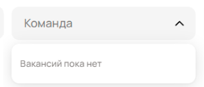 |
| **Пояснение приоритета** | Баг, который вызывает неудобство и ухудшает пользовательский опыт из-за визуальной ошибки, что не убирается раскрывающийся список|

# Bug M.3

| Параметр | Значение |
|----------|----------|
| **Описание** | В направлении "Клиентский сервис" указана цифра "2" - количество вакансий, однако отображается только одна вакансия |
| **Проект** | QA-trainee-assignment-autumn-2025 (Задание 1) |
| **Приоритет (Priority)** | Medium |
| **Ожидаемый результат** | "1" |
| **Полученный результат** | "2" |
| **Скриншот** | 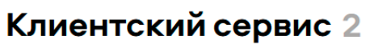 |
| **Пояснение приоритета** | Баг, который вызывает неудобство и ухудшает пользовательский опыт из-за визуальной ошибки, что неправильно отображается количество вакансий |

# Bug M.4

| Параметр | Значение |
|----------|----------|
| **Описание** | Отображается надпись "Ничего не нашлось", хотя были найдены нужные записи |
| **Проект** | QA-trainee-assignment-autumn-2025 (Задание 1) |
| **Приоритет (Priority)** | Medium |
| **Ожидаемый результат** | Отсутствие этой надписи |
| **Полученный результат** | Надпись "Ничего не нашлось..." |
| **Скриншот** |  |
| **Пояснение приоритета** | Баг, который вызывает неудобство и ухудшает пользовательский опыт из-за визуальной ошибки, что неправильно отображается отсутствие вакансий |

# Bug M.5

| Параметр | Значение |
|----------|----------|
| **Описание** | В вакансии "Бизнес-аналитик бизнес-процессов поддержки", указана команда "Услуги", хотя на самом деле эта вакансии не от Команды Авито Услуг |
| **Проект** | QA-trainee-assignment-autumn-2025 (Задание 1) |
| **Приоритет (Priority)** | Medium |
| **Ожидаемый результат** | Отсутствие тега Команды Авито Услуг |
| **Полученный результат** | Тег Команды Авито Услуг |
| **Скриншот** | 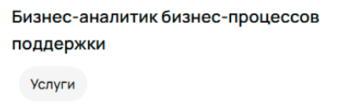 |
| **Пояснение приоритета** | Баг, который вызывает неудобство и ухудшает пользовательский опыт из-за неправильного соотношения команды |

# Bug M.6

| Параметр | Значение |
|----------|----------|
| **Описание** | В вакансии "Руководитель аналитики в транзакционное направление жилой недвижимости" указана команда "Авто", хотя на самом деле эта вакансии от Команды Авито Недвижимости |
| **Проект** | QA-trainee-assignment-autumn-2025 (Задание 1) |
| **Приоритет (Priority)** | Medium |
| **Ожидаемый результат** | Тег Команды Авито Недвижимости |
| **Полученный результат** | Тег Команды Авито Авто |
| **Скриншот** | 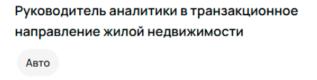 |
| **Пояснение приоритета** | Баг, который вызывает неудобство и ухудшает пользовательский опыт из-за неправильного соотношения команды |

# Bug M.7

| Параметр | Значение |
|----------|----------|
| **Описание** | В вакансии "Аналитик данных в бизнес-команду Авито Авто", указана команда "Недвижимость", хотя на самом деле эта вакансии от Команды Авито Авто |
| **Проект** | QA-trainee-assignment-autumn-2025 (Задание 1) |
| **Приоритет (Priority)** | Medium |
| **Ожидаемый результат** | Тег Команды Авито Авто |
| **Полученный результат** | Тег Команды Авито Недвижимости |
| **Скриншот** |  |
| **Пояснение приоритета** | Баг, который вызывает неудобство и ухудшает пользовательский опыт из-за неправильного соотношения команды |

# Bug M.8

| Параметр | Значение |
|----------|----------|
| **Описание** | Вакансия "Руководитель группы продаж по работе с агентствами" отнесена к направлению "Аналитика данных", хотя на самом деле она должна быть в направлении "Продажи" |
| **Проект** | QA-trainee-assignment-autumn-2025 (Задание 1) |
| **Приоритет (Priority)** | Medium |
| **Ожидаемый результат** | Направление "Продажи" |
| **Полученный результат** | Направление "Аналитика данных" |
| **Скриншот** | 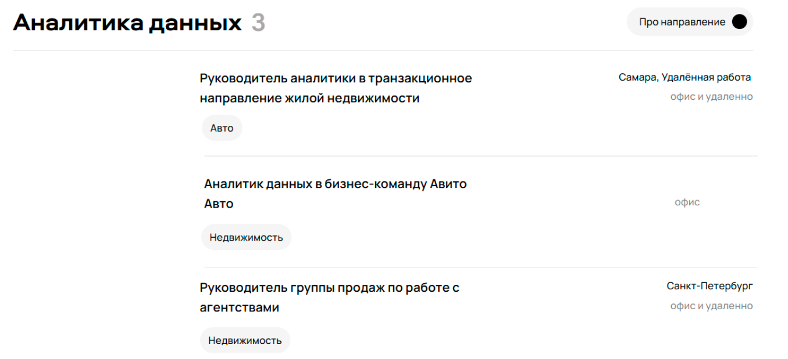 |
| **Пояснение приоритета** | Баг, который вызывает неудобство и ухудшает пользовательский опыт из-за неправильного соотношения вакансии и направления |

# Bug L.1

| Параметр | Значение |
|----------|----------|
| **Описание** | В вакансии "Бизнес-аналитик бизнес-процессов поддержки", где указан формат работы, написано "удаленно", хотя должно быть "можно удаленно" |
| **Проект** | QA-trainee-assignment-autumn-2025 (Задание 1) |
| **Приоритет (Priority)** | Low |
| **Ожидаемый результат** | "можно удаленно" |
| **Полученный результат** | "удаленно" |
| **Скриншот** | 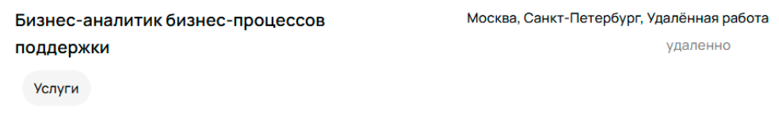 |
| **Пояснение приоритета** | Баг с незначительным несоответствием шаблону написания формата работы |

# Bug L.2

| Параметр | Значение |
|----------|----------|
| **Описание** | В вакансии "Бизнес-аналитик бизнес-процессов поддержки", где указан формат работы, написано "удаленно" cо смещением влево, хотя должно быть выравнено по правому краю |
| **Проект** | QA-trainee-assignment-autumn-2025 (Задание 1) |
| **Приоритет (Priority)** | Low |
| **Ожидаемый результат** | "удаленно" выравнено по правому краю |
| **Полученный результат** | "удаленно" cо смещением влево |
| **Скриншот** |  |
| **Пояснение приоритета** | Баг с незначительным несоответствием шаблону написания формата работы |

# Bug L.3

| Параметр | Значение |
|----------|----------|
| **Описание** | В вакансии "Финансовый аналитик", где указан формат работы, написано "офис" со смещением влево, хотя должно быть выравнено по правому краю, если неправильно сработал фильтр "Формат работы" с поиском "Можно удаленно" и показались записи по поиску "Офис" |
| **Проект** | QA-trainee-assignment-autumn-2025 (Задание 1) |
| **Приоритет (Priority)** | Low |
| **Ожидаемый результат** | "офис" выравнено по правому краю |
| **Полученный результат** | "офис" со смещением влево |
| **Скриншот** | 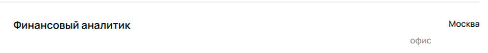 |
| **Пояснение приоритета** | Баг с незначительным несоответствием шаблону написания формата работы |

# Bug L.4

| Параметр | Значение |
|----------|----------|
| **Описание** | В направлении "Аналитика данных", где кнопка "Про направление" не отображена стрелка в черном круге |
| **Проект** | QA-trainee-assignment-autumn-2025 (Задание 1) |
| **Приоритет (Priority)** | Low |
| **Ожидаемый результат** | Стрелка в черном круге-ссылке |
| **Полученный результат** | Отсутствие стрелки в черном круге-ссылке |
| **Скриншот** | 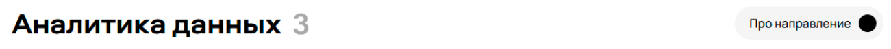 |
| **Пояснение приоритета** | Баг с косметической проблемой |

# Bug L.5

| Параметр | Значение |
|----------|----------|
| **Описание** | В вакансии "Аналитик данных в бизнес-команду Авито Авто", где указан формат работы, написано "офис" со смещением влево, хотя должно быть выравнено по правому краю, если неправильно сработал фильтр "Формат работы" с поиском "Можно удаленно" и показались записи по поиску "Офис" |
| **Проект** | QA-trainee-assignment-autumn-2025 (Задание 1) |
| **Приоритет (Priority)** | Low |
| **Ожидаемый результат** | "офис" выравнено по правому краю |
| **Полученный результат** | "офис" со смещением влево |
| **Скриншот** |  |
| **Пояснение приоритета** | Баг с незначительным несоответствием шаблону написания формата работы |

# Bug L.6

| Параметр | Значение |
|----------|----------|
| **Описание** | В надписи "227 вакансии открыто" допущена ошибка в написании слова, связанного с числом, должно быть "227 вакансий открыто" |
| **Проект** | QA-trainee-assignment-autumn-2025 (Задание 1) |
| **Приоритет (Priority)** | Low |
| **Ожидаемый результат** | "227 вакансий открыто" |
| **Полученный результат** | "227 вакансии открыто" |
| **Скриншот** |  |
| **Пояснение приоритета** | Баг с незначительным несоответствием нормам русского языка |

# Bug L.7

| Параметр | Значение |
|----------|----------|
| **Описание** | В кнопке "Вакансии в Telagram" допущена ошибка в написании слова, должно быть "Вакансии в Telegram" |
| **Проект** | QA-trainee-assignment-autumn-2025 (Задание 1) |
| **Приоритет (Priority)** | Low |
| **Ожидаемый результат** | "Вакансии в Telegram" |
| **Полученный результат** | "Вакансии в Telagram" |
| **Скриншот** |  |
| **Пояснение приоритета** | Баг с незначительным несоответствием названия программного продукта |

# Bug L.8 

| Параметр | Значение |
|----------|----------|
| **Описание** | В поле адреса "Офис в Москве" указан неправильный адрес "ул. Лесная, 77", должно быть "ул. Лесная, 7" |
| **Проект** | QA-trainee-assignment-autumn-2025 (Задание 1) |
| **Приоритет (Priority)** | Low |
| **Ожидаемый результат** | "ул. Лесная, 7" |
| **Полученный результат** | "ул. Лесная, 77" |
| **Скриншот** | 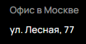 |
| **Пояснение приоритета** | Баг с незначительным несоответствием адреса |
